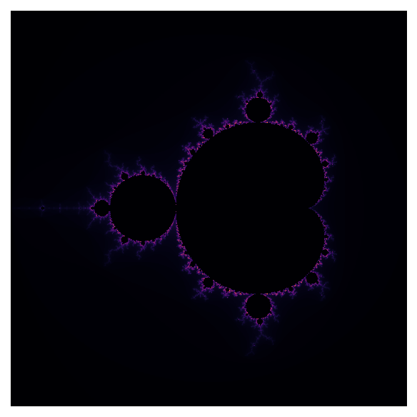

# Mandelbrot Set Renderer
Teaching myself computational mathematics and fractals are cool



## This is the definition: 
z = z^2 + c - all points that go to infinity are not part of the set, all points that never go to infinity are part of the set. This is an interesting property because the fractal is bounded, meaning, it is finite in size or area and infinite in its perimeter

## new things added: 
added a zoom animation into seahorse valley using manim. also vectorized the 
generate_fast() function with numpy since it was processing one pixel at a time which 
was too slow, now it processes the whole grid at once. 

## You run this by..
downloading the code, and running it through your terminal, here's how that goes:

## Dependencies
Ensure you have the following installed: 

```
pip install numpy matplotlib manim
```
## To run this - from terminal:
To render the mandelbrot set:

```
python mandelbrot.py
```
To run the zoom animation:

```
py -m manim zoom.py FractalScene
```
